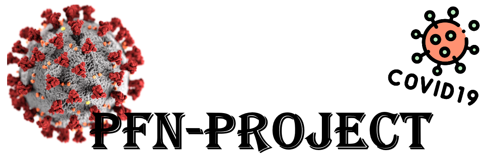
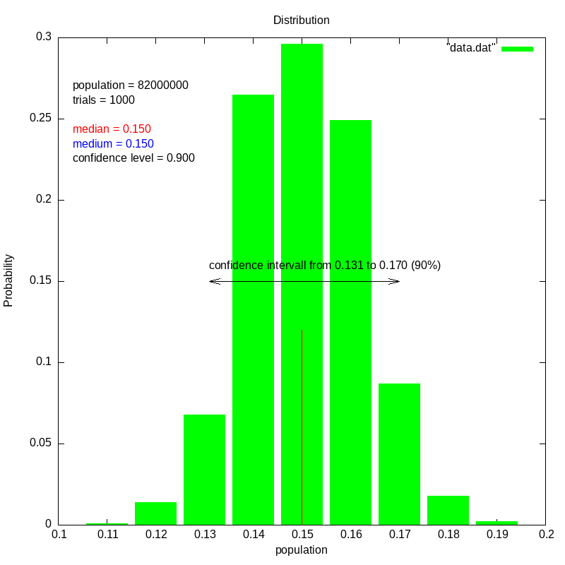

<h1 align="center">
  
</h1>

  <a href="https://github.com/MetaColon/PfN-Project/wiki/Rules-of-Conduct">Rules of Conduct</a> |
  <a href="https://github.com/MetaColon/PfN-Project/wiki/Projects">Projects</a> |
  <a href="https://github.com/MetaColon/PfN-Project/wiki/Git-Guide">Git Guide</a> |
  <a href="https://github.com/MetaColon/PfN-Project/wiki/Interface-Workflow">Interface Workflow</a> |
  <a href="https://github.com/MetaColon/PfN-Project/blob/master/CODE_OF_CONDUCT.md">CODE OF CONDUCT</a>

The repository for the PfN (2) project in physics
This project aims to look at the uncertainty in the study from the university of Bonn and perhaps, the similar study of Santa Monica area.

    <b>
      Our latest compiled Histogram:
    </b>  

  

## Getting Started

These instructions will get you a copy of the project up and running on your local machine for development and testing purposes. See deployment for notes on how to deploy the project on a live system.

### Prerequisites

You need to have GnuPlot installed

On **Linux**:

`
sudo apt-get install gnuplot gnuplot-x11 gnuplot-doc 
`

On **Mac**:
We are using homebrew to install Gnuplot on Mac
To install homebrew do:

`/bin/bash -c "$(curl -fsSL https://raw.githubusercontent.com/Homebrew/install/master/install.sh)"`

And then do to install gnuplot

`
brew install Gnuplot
`

## Running it
You have to be in the Main `PfN-Project` Directory and do:

`make`

**Usage:** `./Program.x <Ps> <Ss> <Sc> 
 [<s>] [<se>] [<sp>]`

## Running the tests
We use Check, to install check do:

`apt-get install check` or `brew install check`

To Run the tests do:

`cd Tests`

`make`

`./Checks.x`

## Authors

* **MetaColon** - [GitHub](https://github.com/MetaColon), [Website](http://teemze.de)
* **TomHrm** - [GitHub](https://github.com/TomHrm)
* **RalfSchmelcher** - [GitHub](https://github.com/RalfSchmelcher)
* **tore1311** - [GitHub](https://github.com/tore1311)
* **s-hartig** - [GitHub](https://github.com/s-hartig)
* **Paklgit** - [GitHub](https://github.com/Paklgit)
* **Jubi72** - [GitHub](https://github.com/Jubi72)
* **Hneuschmidt** - [GitHub](https://github.com/Hneuschmidt)

## License

This project is licensed under "THE BEER-WARE LICENSE" - see the [License.txt](License.txt) file for details
